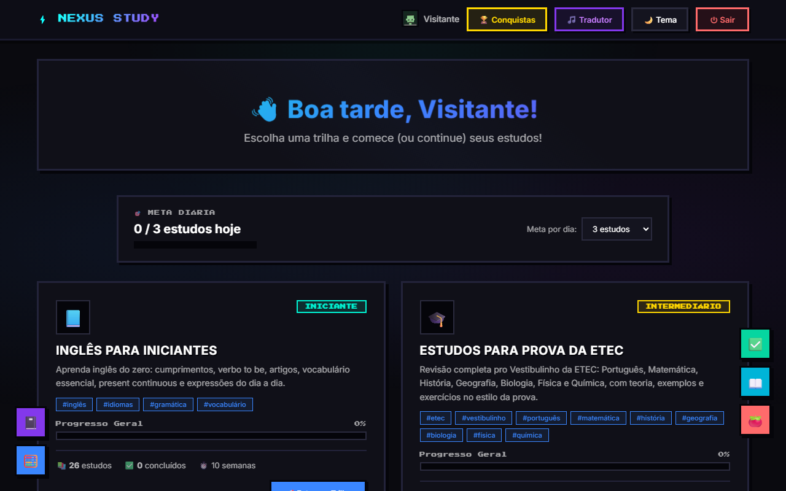

# ⚡ Nexus Study

Plataforma de estudos gamificada, com trilhas de conteúdo, exercícios interativos, conquistas e um painel de admin — construída do zero como projeto pessoal para ajudar parentes e colegas a estudar (inglês do zero e revisão para o Vestibulinho da ETEC).

**🔗 Acesse:** https://matheusedu01.github.io/nexus-study/



## O que tem aqui

- **Trilhas de estudo com conteúdo real**: um curso completo de "Inglês para Iniciantes" e uma trilha de revisão para a prova da ETEC, com teoria, tabelas, exemplos resolvidos, quizzes, flashcards e exercícios com correção automática.
- **Painel de admin**: cria/edita trilhas e aulas, importa conteúdo pronto, exporta relatórios de alunos — e qualquer edição aparece na hora para todo mundo, em qualquer dispositivo.
- **Gamificação**: sistema de conquistas, sequência de dias estudados, metas diárias e progresso por trilha.
- **Avatar 8-bit**: 31 personagens desenhados em SVG puro (sem nenhuma imagem externa), escolhidos numa galeria.
- **Widgets de apoio**: calculadora, caderno de anotações, timer Pomodoro, dicionário de tradução e lista de tarefas, flutuantes em qualquer página.
- **Tradutor de música**: cola a letra de uma música e traduz.
- **Tema retro/8-bit**: visual todo em pixel art, fonte pixelada, sombras duras — com tema claro/escuro.

## Stack técnica

Este projeto começou 100% estático (HTML/CSS/JS puro, sem build step, sem framework) hospedado no GitHub Pages, salvando tudo em `localStorage`. Com o tempo, evoluiu para:

- **Firebase Authentication** — login/cadastro de alunos e admin, sem senha em texto puro em lugar nenhum.
- **Cloud Firestore** — conteúdo das trilhas e dados de progresso/conquistas/avatar sincronizados entre dispositivos, com regras de segurança (cada aluno só lê/escreve os próprios dados; o conteúdo das trilhas é público para leitura e só o admin autenticado pode editar).
- **GitHub Pages** — hospedagem estática, deploy automático a cada push na branch `main`.

Não usa nenhum framework de frontend nem bundler — todo o site é HTML/CSS/JS direto no navegador, com módulos ES nativos (`<script type="module">`) para a parte que fala com o Firebase.

## Estrutura do projeto

```
├── index.html              # Login/cadastro de aluno
├── dashboard.html           # Lista de trilhas
├── trilha-detalhe.html      # Módulos e aulas de uma trilha
├── estudo.html               # Conteúdo de uma aula (com quiz/exercícios)
├── perfil.html                # Avatar, frase, progresso, conquistas
├── conquistas.html          # Todas as conquistas
├── admin-login.html / admin.html   # Painel administrativo
├── js/
│   ├── firebase-init.js          # Configuração do Firebase
│   ├── trilhas-firestore.js      # Sincronização do conteúdo das trilhas
│   ├── usuario-firestore.js      # Sincronização de progresso/conquistas/avatar
│   ├── conteudo-render.js        # Motor que transforma o texto das aulas em quiz/tabela/flashcard/exercício
│   ├── avatar-pixel.js           # Gerador dos personagens 8-bit em SVG
│   └── ...
└── dados/trilhas.json       # Seed inicial de conteúdo
```

## Rodando localmente

Não precisa de build nem instalação de dependências — é só servir os arquivos estáticos:

```bash
python -m http.server 8123
# ou: npx http-server -p 8123
```

Depois abra `http://localhost:8123`. Pra usar as funcionalidades que dependem do Firebase (login, sincronização), você precisa criar seu próprio projeto no [console do Firebase](https://console.firebase.google.com) (Authentication + Firestore) e colocar as credenciais em `js/firebase-init.js`.

## O que fica documentado como aprendizado

Esse projeto passou por uma migração real de arquitetura: começou inteiramente client-side (sem nenhum backend, dados presos no navegador de cada usuário) e foi evoluindo pra usar autenticação e banco de dados de verdade, mantendo o site 100% estático hospedado no GitHub Pages — sem precisar de servidor próprio. Também foi onde resolvi bugs de sincronização entre dispositivos, corrigi um parser de tabelas que quebrava com certos formatos de conteúdo, e construí um mini "motor de conteúdo" com tags próprias (`<quiz>`, `<flashcard>`, `<exercicio-interativo>`, `[TABELA]`) pra criar aulas interativas sem escrever HTML na mão.
